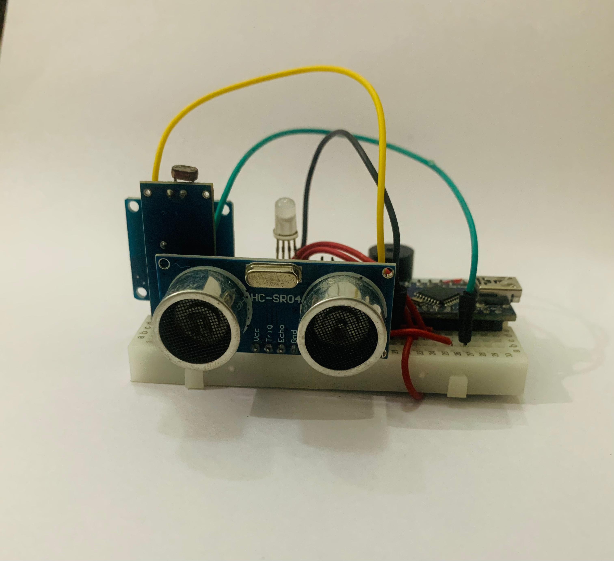
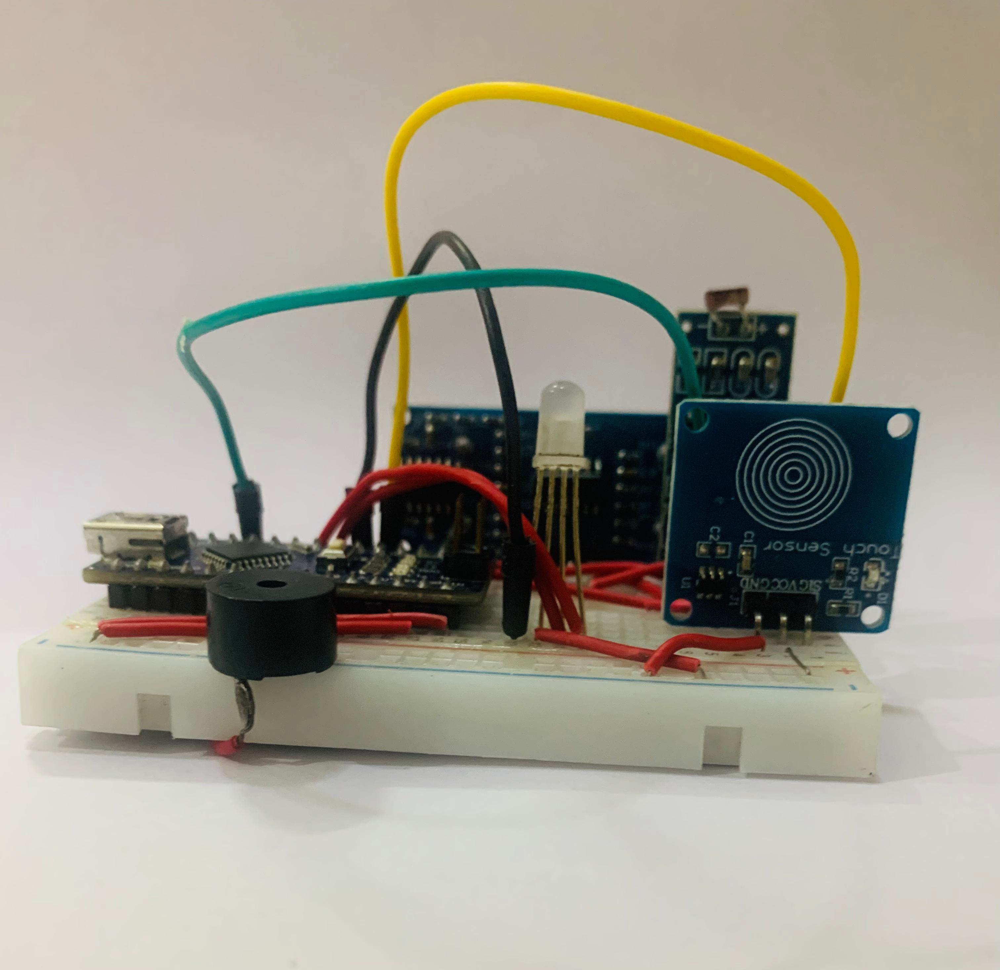
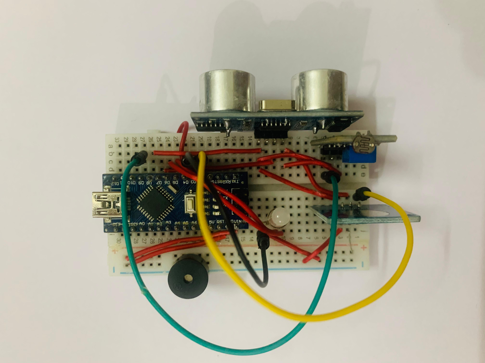

# Sensor-Based Motion Detection and Alarm System

---

## Overview

A smart Arduino-based security system that detects motion using an ultrasonic sensor and provides visual (RGB LED) and audio (buzzer) alerts. The system supports three modes (Day Only, Night Only, Always On) selected via a touch sensor. It automatically arms or disarms based on the ambient light detected by an LDR. When armed, any detected motion triggers an alarm.

---

## Features

- **Motion detection** with ultrasonic sensor.
- **Auto arming/disarming** based on light and selected mode.
- **Three modes:**  
  - **Day Only:** Active only in bright light (red LED).  
  - **Night Only:** Active only in dark (blue LED).  
  - **Always On:** Active at all times (green LED).
- **Touch sensor** to change modes (with sound and color feedback).
- **Alarm:** Loud buzzer and flashing red LED on intrusion.
- **Breathing LED** effect when idle to indicate readiness.

---

## Hardware Pinout

| Component          | Arduino Pin |
|--------------------|-------------|
| Ultrasonic Trigger | 7           |
| Ultrasonic Echo    | 8           |
| Buzzer             | 4           |
| Touch Sensor       | 2           |
| LDR (Light Sensor) | 9           |
| RGB LED Red        | 3           |
| RGB LED Green      | 5           |
| RGB LED Blue       | 6           |

---

## How it Works

1. **Startup:** LED cycles colors, buzzer plays a tune.
2. **Mode selection:** Tap the touch sensor to cycle through Day Only, Night Only, and Always On modes.
3. **Arming/disarming:**  
   - **Day Only:** Armed in bright light, disarmed in darkness.  
   - **Night Only:** Armed in darkness, disarmed in light.  
   - **Always On:** Always armed.
4. **Detection:** When armed, motion within a set distance triggers the alarm.
5. **Alarm:** Buzzer sounds and LED flashes red. The alarm stops automatically after a short duration or when the mode is changed.
6. **Idle:** When waiting, the LED gently “breathes” to show readiness.

---

## Usage

1. Power on the system. Wait for the startup sequence.
2. Select the desired mode using the touch sensor.
3. The LED color shows the current mode. System arms/disarms automatically.
4. When armed, any motion within range triggers a loud alarm and flashing LED.
5. To reset the alarm, wait or change the mode.

---

## Application

- Home and room security
- Automatic lighting triggers
- Demo for sensor integration and automation

---

## Source Code

The Arduino source code is provided in [`motion_alarm_system.ino`](motion_alarm_system.ino).

---

## License

MIT License
